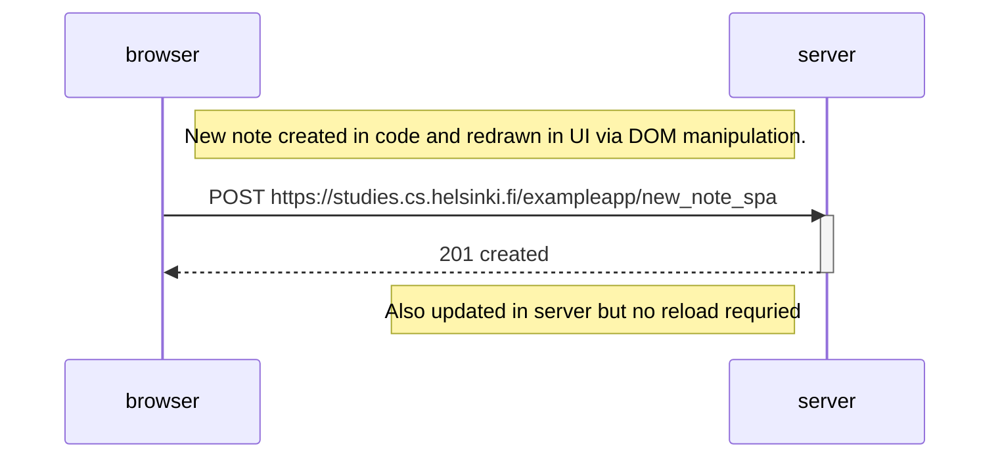

```mermaid
sequenceDiagram
    participant browser
    participant server

    Note right of browser: New note created in code and redrawn in UI via DOM manipulation.

    browser->>server: POST https://studies.cs.helsinki.fi/exampleapp/new_note_spa
    activate server
    server-->>browser: 201 created
    deactivate server

    Note left of server: Also updated in server but no reload requried
```